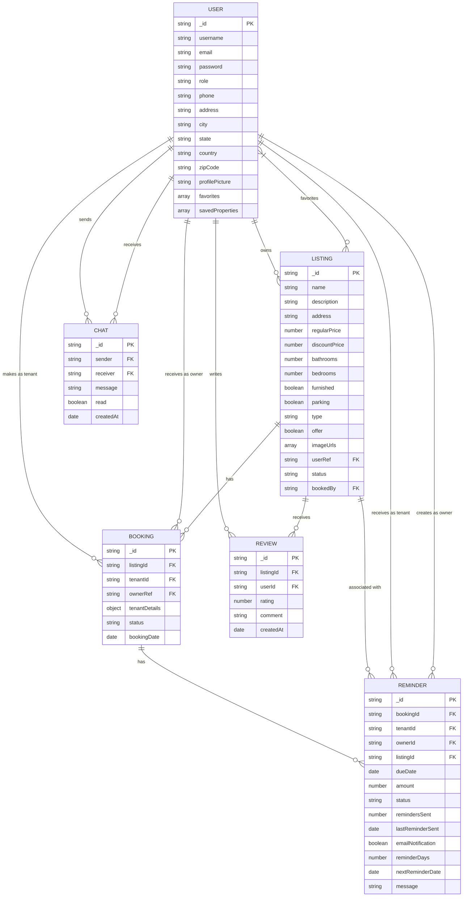

# Real Estate Project - Entity Relationship Diagram

## Entity Descriptions

### User
- Represents all system users with different roles (tenant, owner, admin)
- Contains personal information and authentication details
- Can have favorites and saved properties (references to Listings)

### Listing
- Represents real estate properties available for rent
- Contains property details, pricing, and features
- Linked to an owner user through userRef
- Can be marked as available or booked

### Booking
- Represents a rental agreement or booking request
- Links a tenant to a specific property
- Contains status (pending, approved, rejected)
- Includes tenant details and booking date

### Chat
- Represents messages exchanged between users
- Contains sender, receiver, message content, and read status
- Supports direct communication between tenants and owners

### Reminder
- Represents rent payment reminders
- Linked to a booking, listing, tenant, and owner
- Contains payment details, due date, and reminder settings
- Supports automatic reminder scheduling

### Review
- Represents tenant reviews of properties
- Contains rating and comment information
- Links a user (reviewer) to a listing
- Helps future tenants make informed decisions

## Key Relationships

1. A user (owner) can have multiple listings
2. A user (tenant) can make multiple bookings
3. A listing can have multiple bookings
4. A booking can have multiple rent reminders
5. Users can send/receive multiple chat messages
6. Users can write multiple reviews for different listings
7. A listing can receive multiple reviews from different users
8. Users can favorite multiple listings
