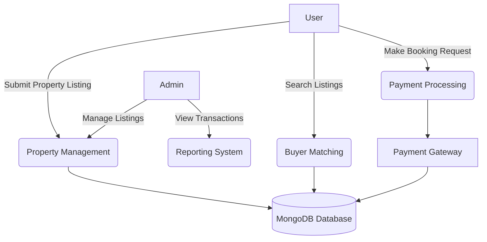

# Real Estate Platform Data Flow Diagram

The Data Flow Diagram (DFD) provides an overview of the entire system, illustrating how property listing requests are processed. It represents the flow of information between different modules, including buyer-seller matching, booking notifications, and property management. The key processes involved are submitting a property listing, matching and notifying potential buyers, processing booking requests, and tracking transaction history.

## Key Processes:
1. **Property Listing Submission** - Users submit property details through web forms
2. **Buyer-Seller Matching** - Automated matching based on property criteria
3. **Booking Management** - Handling reservation requests and availability
4. **Transaction Processing** - Secure payment handling through integrated gateways
5. **User Notifications** - Real-time updates via email and in-app alerts

## System Modules:
- Property Listing Interface
- User Authentication Service
- Booking Management System
- Payment Integration
- Admin Dashboard
